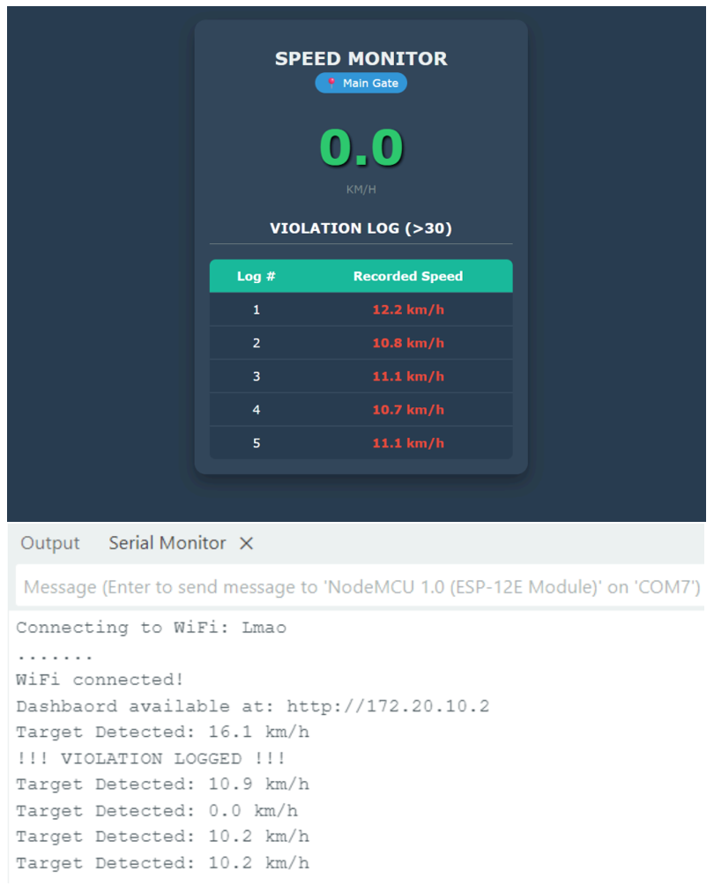

# Radar-Based Speed Monitoring & ANPR System

A dual-node embedded system that detects vehicle speed using a Doppler radar sensor
and automatically captures and identifies license plates of overspeeding vehicles.

## System Overview

## Key Features
- Real-time vehicle speed detection using Doppler radar
- Overspeed violation logic on ESP8266
- Live web dashboard with speed display and violation log
- Automatic image capture using ESP32-CAM
- License plate recognition using YOLO and OCR on a Flask backend

## System Architecture
The system is split into two embedded nodes:

### ESP8266 — Sensing & Control Node
- Interfaces with Doppler radar via UART
- Parses radar data and calculates vehicle speed
- Detects overspeed violations
- Hosts a local web dashboard (HTML/CSS/JS)

### ESP32-CAM — Vision Node
- Captures images when triggered by overspeed events
- Encodes images as JPEG
- Sends images to a backend server via HTTP POST

## Web Dashboard

The dashboard provides:
- Live speed monitoring
- Visual overspeed indication
- FIFO-based violation logging

## Backend Processing
A Flask server processes images sent by the ESP32-CAM:
- YOLO model detects license plate regions
- OCR extracts alphanumeric plate information

## Hardware Used
- ESP8266 NodeMCU
- ESP32-CAM (AI Thinker)
- HLK-LD2415H 24 GHz Doppler Radar

## Repository Structure
esp8266_radar_server/ -> Radar sensing + web server firmware

esp32_cam_client/ -> Camera capture + HTTP client firmware

docs/ -> System diagrams and screenshots

## Notes
- WiFi credentials and server configuration are stored in `config.h` (not tracked)
- The system is designed to be modular and scalable